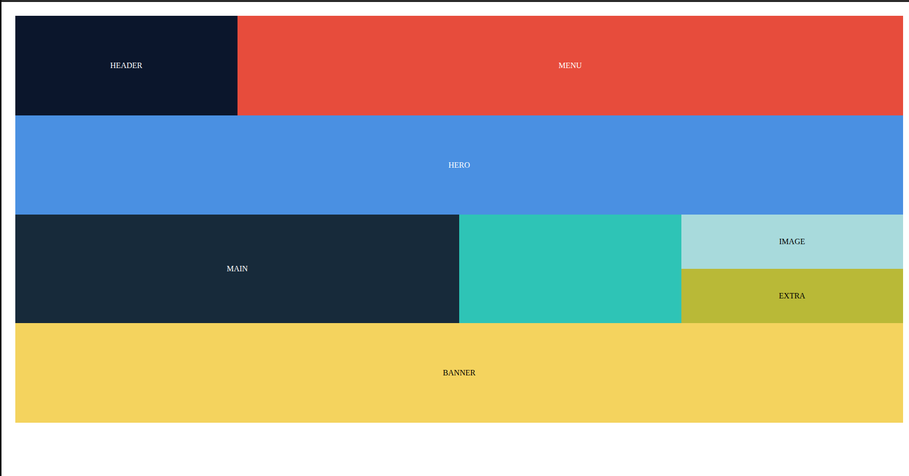
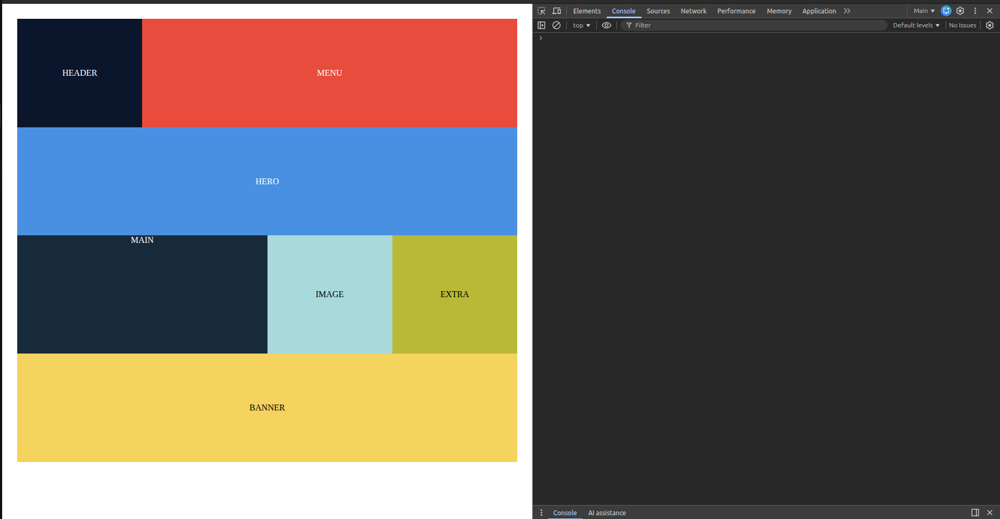

## Day 1
On day 1, I got hands-on with semantic HTML5, learning to structure web pages using `<header>`, `<footer>`, `<nav>`, `<main>`, `<section>`, and `<article>`. I explored forms along with basic validation and accessibility principles to make web pages user-friendly. Additionally, I got introduced to multimedia elements like `<video>`, `<audio>`, and `<canvas>`. Along with all these i created the html structure for a blog page using semantic html only.
    <figure>
      
      <figcaption>this is the preview of the html structure, it looks so as there is no css applied</figcaption>
    </figure>

## Day 2
  On day 2, I learned about CSS, about various selectors including attribute selectors, sibling selectors. I explored the box model, specificity rules, and units like `rem`, `vw`, and `vh`. I practiced layout techniques using Flexbox and Grid for 2D layouts, and focused on responsive design principles with a mobile-first approach and media queries. Finally, I got hands-on with animations and transitions to make web pages more interactive and visually appealing.
        | Flexbox (Large) | Grid (Large) |
|-----------------|------------------|
|  |  |

| Flexbox (Medium) | Grid (Medium) |
|-----------------|--------------|
| |  |

| Flexbox (Small) | Grid (Small) |
|---------------|--------------|
|   |  |

## Day 3
On day 3, I learned JavaScript fundamentals, working with `let` and `const`, arrow functions, and manipulating arrays and objects using methods like `map`, `filter`, and `reduce`. I practiced these concepts through mini-challenges that strengthened my problem-solving skills. I also explored DOM manipulation by building components such as a navbar toggle and dropdown FAQs. Additionally, I used event listeners to create features like a counter and key-based interactions. Als, I built an interactive FAQ accordion where clicking each question expands or collapses the answer.
| Initial State | Expanded FAQ Section |
|---------------|--------------------|
|  |  |

| Opening Specific Answers | Handling Overflow using Scrolling |
|-------------------------|-----------------|
|  |  |

## Day 4
On this day, I focused on modular JavaScript functions and explored LocalStorage for persisting data across page reloads. I practiced debugging using DevTools breakpoints and watch expressions and built custom JS utilities like debounce, throttle. As a hands-on project, I created a Todo app that persists tasks on refresh using LocalStorage including all the basic functionalities of Adding, Editing, Deleting and marking tasks as complete. Additionally, I learned error handling with `try/catch` and implemented an error boundary folder to log errors systematically in `logs/errors.md`.

### Todo App ScreenShots

| Initial Loading (Tasks from LocalStorage) | Modal for Adding/Editing Tasks |
|-----------------------------------------|-------------------------------|
|  |  |

| Responsive Modal | Fully Responsive Todo App |
|-----------------|--------------------------|
|  |  |

## Day 5

On Day 5, I built an E-commerce product listing page using all the learnings from Week 2. The page layout was created using Flexbox and semantic HTML. I used the fetch API along with async/await to get products from DummyJSON, and wrapped the fetching logic in a try/catch block to prevent the app from breaking in case of errors.  

For each product, I created a card element and displayed it on the page with the product title, image, and price. I practiced mouse events like mouseenter and mouseleave to manipulate the displayed image on the cards. I also implemented a sorting functionality using a button, which sorts the products from high price to low price when clicked. Additionally, I added debouncing to the search bar to optimize performance while filtering products.  

Finally, I made the page fully responsive using CSS media queries, so it works well on different screen sizes.

### E-commerce Product Listing Page
| Landing Page | Product Listing (Large Screen) |
|--------------|-------------------------------|
|  |  |

| Sorted Products (High → Low) | Product Listing (Large Screen) |
|-------------------------------|-------------------------------|
|  |  |

| Product Listing (Medium Screen) | Product Listing (Mobile Screen) |
|-------------------------------|-------------------------------|
|  |  |

| Product Listing (Extra Small Screen) | Search Bar Filtering |
|------------------------------------|-------------------|
|  |  |
