# WEEK 3 

## ScreenShots

### Login Page

This is the login page. I have implemented a middleware that checks the user's login status on every route request. It checks whether the user is logged in by verifying if the username is stored in the local storage. If the user is not logged in, they are redirected to the login page.

| **For Larger Screens** | **For Mobile Screens** |
| ---------------------- | ---------------------- |
| 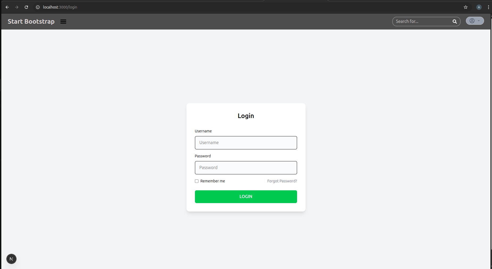 | 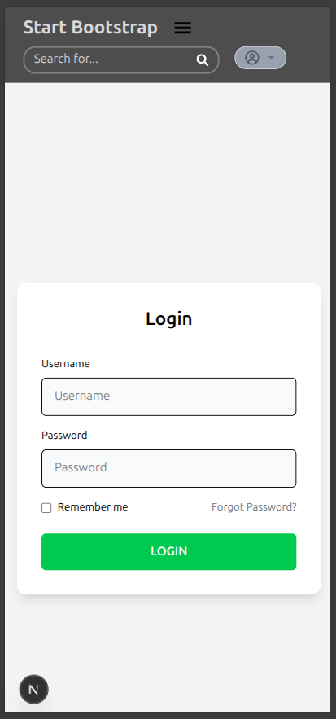 |

Here is how the user's info is stored in the local storage:

| **Local Storage Info** |
| ---------------------- |
| 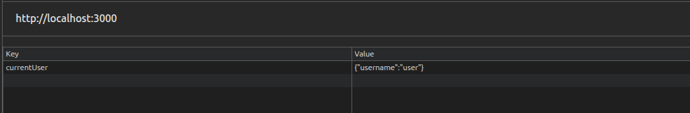 |

After login, the user is redirected to the home page.

---

### Home/Landing Page

| **For Larger Screens** | **For Mobile Screens** |
| ---------------------- | ---------------------- |
| 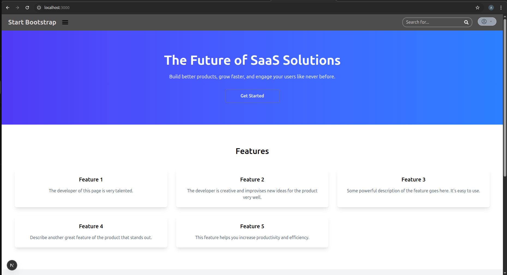 | 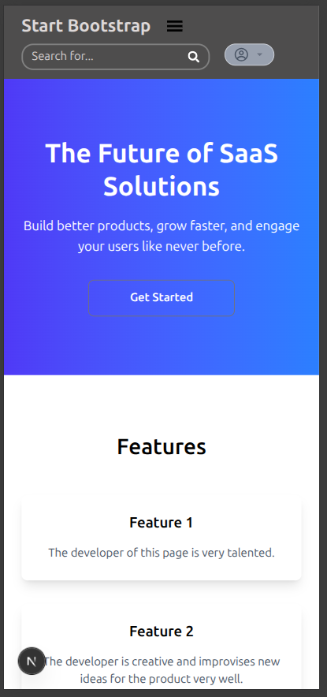 |

---

### Dashboard

From the sidebar, the user can navigate to the dashboard. In the header, the user can navigate to the profile page. On the dashboard, I have displayed various cards for different purposes, along with area and bar charts.

The cards are rendered using a reusable component, and the popup modal that appears when clicking on the card button is also rendered using a reusable component. Each popup modal takes button-specific details.

| **For Larger Screens** | **For Mobile Screens** |
| ---------------------- | ---------------------- |
| 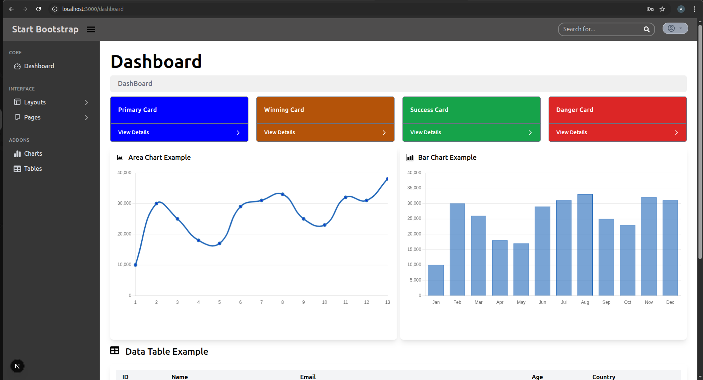 | 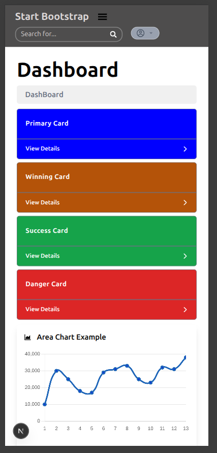 |
| 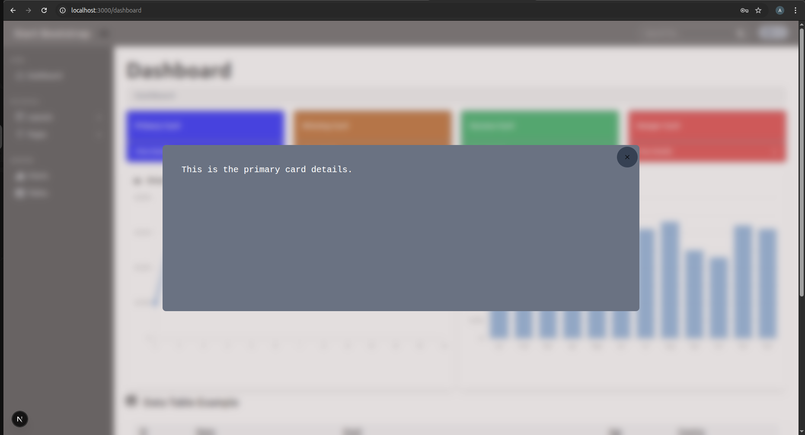 | 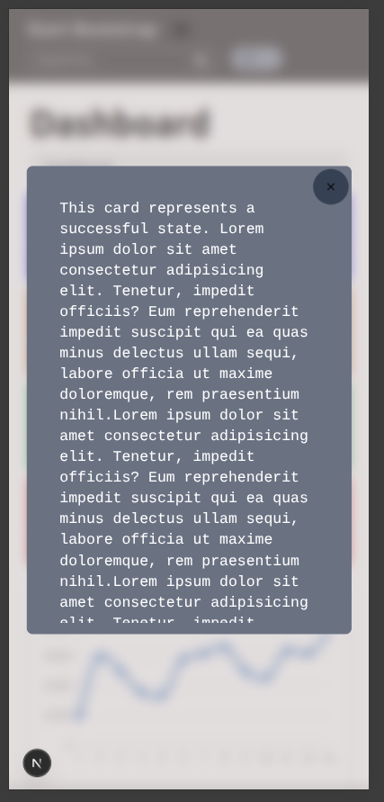 |

---

### Sidebar and Dynamic Routing

In the sidebar, I used some routes, and based on that, I implemented dynamic routing for the layout and the pages dropdown.

| **Dynamic Routes in VS Code** |
| ---------------------------- |
| 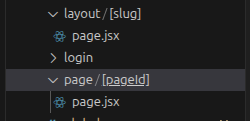 |

Here, I have destructured the parameters and extracted the params array:

| **Destructuring Params and Extracting Values** |
| --------------------------------------------- |
| 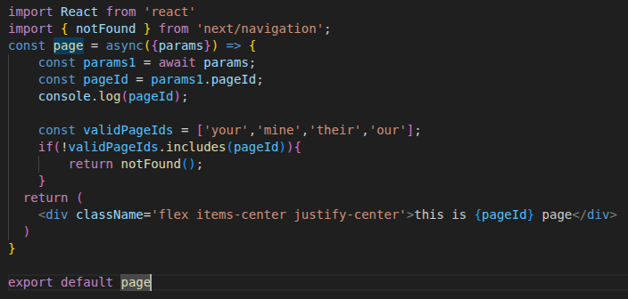 |

---

### Users Listing Page

This is the users listing page for larger screens. Each page shows some details using the reusable popup details.

| **For Larger Screens** | **For Mobile Screens** |
| ---------------------- | ---------------------- |
| 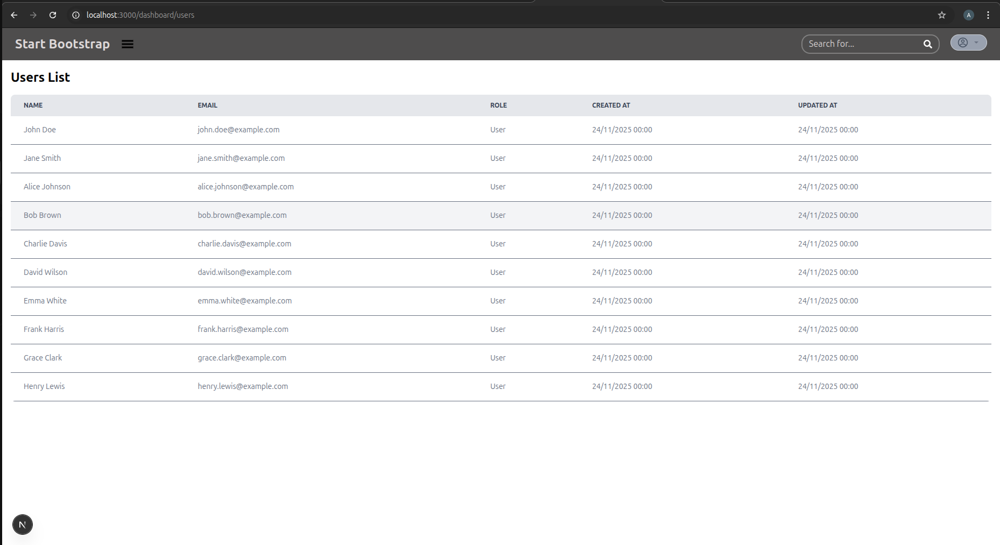 | 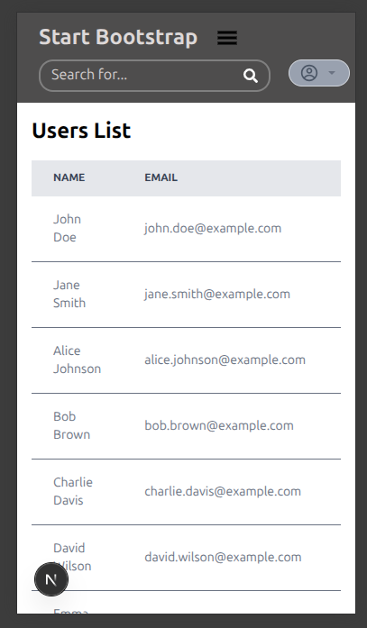 |
| 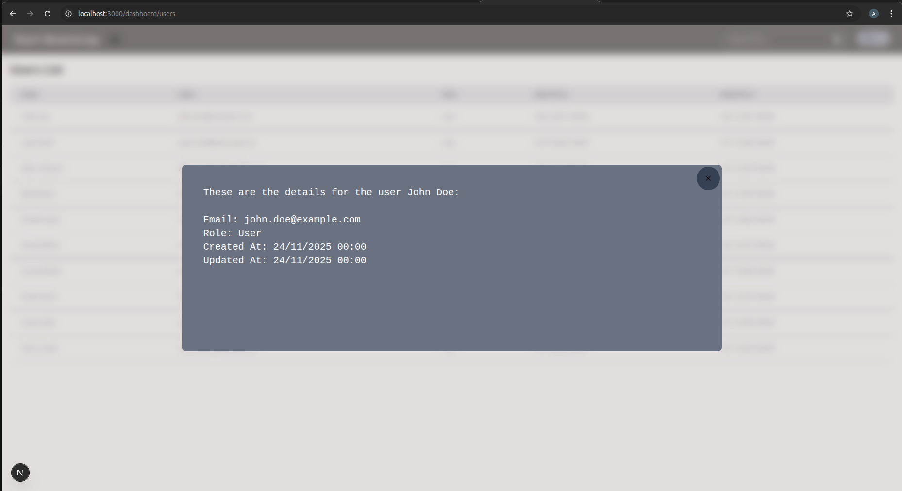 | 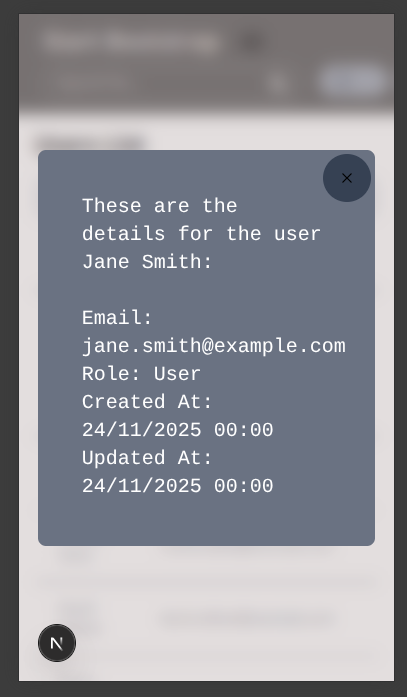 |

---

### Profile Page

This is the profile page for larger screens.

| **For Larger Screens** | **For Smaller Screens** |
| ---------------------- | ----------------------- |
| 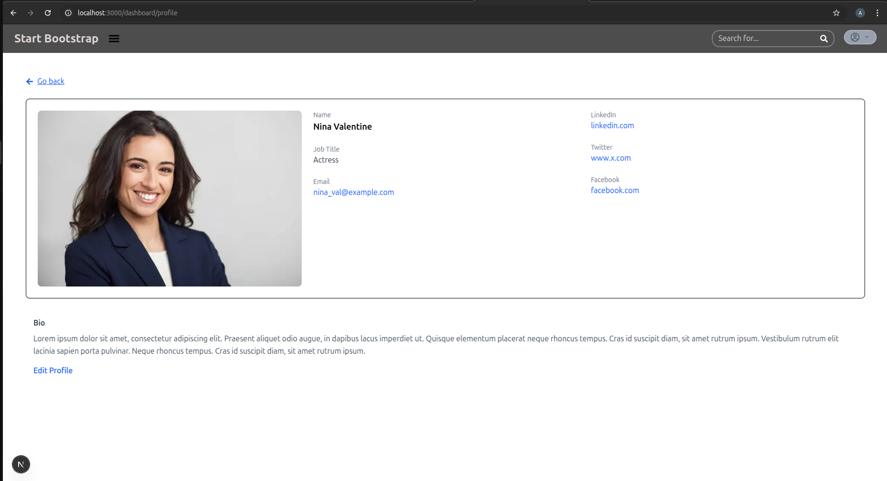 | 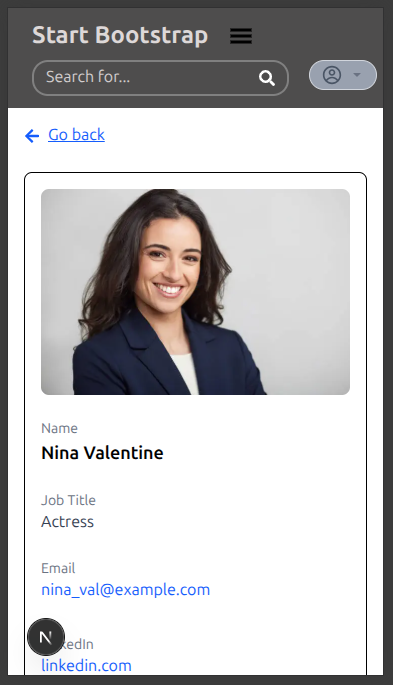 |

---

## Folder Structure

        └── practice/
            ├── README.md
            ├── eslint.config.mjs
            ├── jsconfig.json
            ├── next.config.mjs
            ├── package.json
            ├── postcss.config.mjs
            └── src/
                ├── app/
                │   ├── globals.css
                │   ├── layout.js
                │   ├── page.jsx
                │   ├── _utils/
                │   │   ├── AreaChart.jsx
                │   │   ├── BarChart.jsx
                │   │   ├── Features.jsx
                │   │   ├── Footer.jsx
                │   │   ├── Header.jsx
                │   │   ├── Hero.jsx
                │   │   ├── LoginMiddleware.jsx
                │   │   ├── Sidebar.jsx
                │   │   ├── Table.jsx
                │   │   └── Testimonials.jsx
                │   ├── about/
                │   │   └── page.jsx
                │   ├── dashboard/
                │   │   ├── page.jsx
                │   │   ├── (profiles)/
                │   │   │   └── profile/
                │   │   │       └── page.jsx
                │   │   └── users/
                │   │       ├── page.jsx
                │   │       └── Users.jsx
                │   ├── layout/
                │   │   └── [slug]/
                │   │       └── page.jsx
                │   ├── login/
                │   │   ├── Login.jsx
                │   │   └── page.jsx
                │   └── page/
                │       └── [pageId]/
                │           └── page.jsx
                ├── components/
                │   ├── UI-COMPONENT-DOCS.md
                │   └── ui/
                │       ├── Button.jsx
                │       ├── Card.jsx
                │       ├── ChartCard.jsx
                │       ├── FeatureCard.jsx
                │       ├── Modal.jsx
                │       └── TestimonailsCard.jsx
                └── pages/
                    └── profile.jsx

## Components List

### The Card Component
I have made Card as a reusable component which can be used differently each time different props are passed to it.

`const Card = ({height='120px',width='310px',label='Default Label',details='This is the default text for details',color ='red', handleModalOpen=''})`

As you can see, it takes multiple props which include height, width, label, details and color. In case I do not want to pass props, this component accepts default props also which are specified above. Using different props we can render different cards with different information. Also this component is used along with the popup modal and hence accepts a `handleModalOpen` function that handles opening the popup modal as the name suggests.

---

### The PopUp Modal Component
This component is also reusable and accepts props:

`const Modal = ({handleModalClose,modalDetails})`

So it takes two props, one is `handleModalClose` that is a function which will be called when closing the modal by clicking the cross button or by clicking outside the information card.  
The other prop is the `modalDetails`, this is the information that will be displayed inside the modal. By passing these two props we can use this modal differently everytime.

---

### The Button Component
This is a simple reusable button component:

`const Button = ({title, handleClick,color="white", background = "gray", height="50px", width="200px", radius="rounded-lg"})`

It takes multiple props for customizing the button like text color, background color, height, width and the border radius.  
If no props are passed, the button will use the default props mentioned above.  
This button also accepts a `handleClick` function which will run whenever the button is clicked.  
Using these props we can create different types of buttons for different needs.

---

### The ChartCard Component
This component is used to display charts inside a card layout:

`const ChartCard = ({ title, logo, children })`

It takes three props:  
- `title` to show the name of the chart  
- `logo` to show any icon or symbol  
- `children` which will be the actual chart

By passing different charts as children, we can reuse the same card structure for any type of chart.

---

### The FeatureCard Component
This is a reusable card to show small information sections:

`const FeatureCard = ({ title, description })`

It accepts two props which are `title` and `description`.  
Both of these props are displayed inside a styled card layout.  
By changing the title and description, we can use this card anywhere to show simple feature blocks.

---

### The TestimonialCard Component
This component is used to display user or client testimonials:

`const TestimonialCard = ({ text, name, title })`

It accepts three props:  
- `text` which is the testimonial message  
- `name` which is the user's name  
- `title` which is the user's profession or role  

By passing different values we can display different testimonials using the same card layout.

---

## DAY 1 
 on day 1 i learned the nextjs basics and fundamentals, how to create components in nextjs , how nextjs has file based routing and how can we create some private folders inside the app directory which are not served as routes. also i learned how layout is applied to the children.Along with this i learned how we can group the routes.
 Then i made a navbar whic had the logo for site and a searchbar with a button to redirect the user to profile page using the `Link` tag, there i came to know how next js optimizes the navigation, while using the `<Link> </Link>` tag it prefetches the data when the link is visible to viewport or is hovered.

