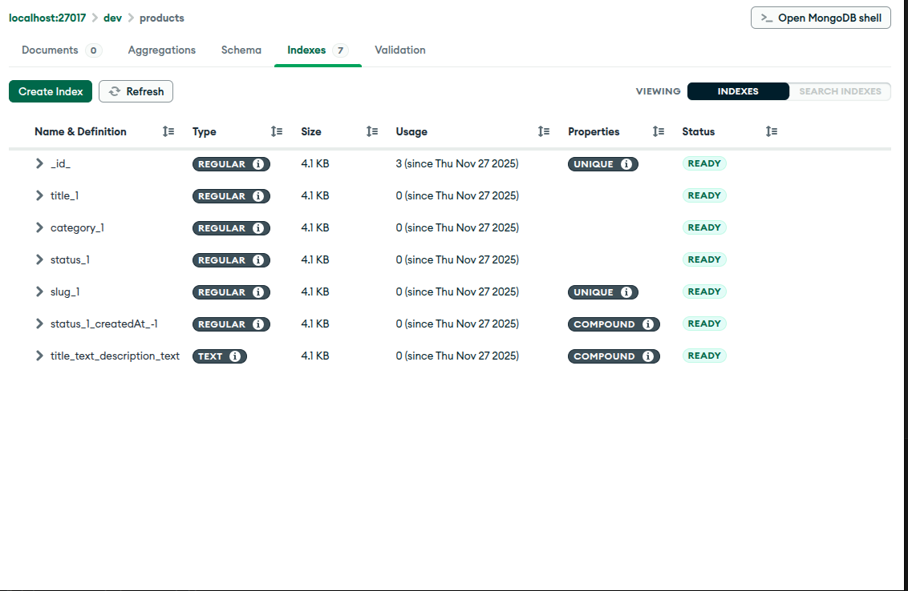
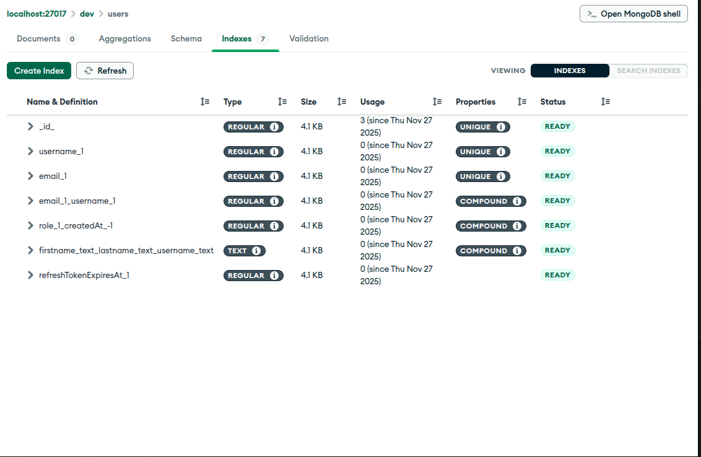

# Index Analysis for Product and User Schemas

---

## Product Schema

The product schema has the following indexes:

### Indexed Fields:

1. **\_id**: Regular index (unique)
2. **title_1**: Regular index
3. **category_1**: Regular index
4. **status_1**: Regular index
5. **slug_1**: Regular index (unique)
6. **status*1.createdAt*-1**: Compound index (TTL)
7. **title_text_description_text**: Text index

### Explanation:

- **Regular Index**: This type of index is created for most fields to speed up simple queries. For example, fields like `_id`, `title`, `category`, `status`, and `slug` are all indexed with a regular index. The `_id` field is also marked as `unique` to ensure each product has a unique identifier.

- **Compound Index**: The `status_1.createdAt_-1` is a compound index, meaning it indexes multiple fields together. In this case, it indexes `status_1` and `createdAt`. The order matters here because the index will first use `status_1` for filtering and then `createdAt` for sorting in descending order (indicated by `-1`).
- **TTL (Time To Live) Index**: The compound index `status_1.createdAt_-1` is also a TTL index. TTL indexes can only be applied to date-type fields. The TTL index allows MongoDB to automatically remove documents after a certain period, which is useful for expiring data (e.g., sessions, logs).

- **Text Index**: The `title_text_description_text` field is indexed with a text index. Text indexes are used to enable full-text search capabilities. They use stemming tokenization to break down words into their root forms, improving search results. The index also applies relevance scoring to rank documents based on their content's relevance to the search query. In this case, the fields `title`, `text`, and `description` are being indexed for text searches.

---

## User Schema

The user schema has the following indexes:

### Indexed Fields:

1. **\_id**: Regular index (unique)
2. **username_1**: Regular index (unique)
3. **email_1**: Regular index (unique)
4. **email_1_username_1**: Compound index
5. **role*1.createdAt*-1**: Regular index (TTL)
6. **firstname_text_lastname_text_username_text**: Text index
7. **refreshTokenExpiresAt_1**: Regular index

### Explanation:

- **Regular Index**: Similar to the product schema, regular indexes are used for fields like `_id`, `username`, `email`, and `refreshTokenExpiresAt`. The `_id`, `username`, and `email` fields are also marked as `unique` to ensure they are unique across documents.

- **Compound Index**: The `email_1_username_1` field is a compound index. This index allows efficient querying of both the `email` and `username` fields together. The order of the fields in the compound index affects the query's efficiency, as MongoDB will first use `email_1` and then `username_1` in queries that match both fields.

- **TTL (Time To Live) Index**: The `role_1.createdAt_-1` field is a TTL index. Like in the product schema, TTL indexes are applied only to date-type fields. MongoDB will automatically delete documents based on the time specified in the `createdAt` field, ensuring data is only retained for as long as needed.

- **Text Index**: The `firstname_text_lastname_text_username_text` field is indexed with a text index. It allows for searching on the `firstname`, `lastname`, and `username` fields with full-text search features, including stemming and relevance scoring.

---

## Sparse Index

In MongoDB, a sparse index is an index that only includes documents with the indexed field present. If a document does not contain the indexed field, it will not be included in the index, making it useful for sparse data sets where some documents may lack certain fields.

While the images you provided do not explicitly show sparse indexes, understanding their concept is important in designing efficient indexes. Sparse indexes are particularly useful for optional fields or fields that only apply to a subset of documents.

---

This document should help you understand the different types of indexes used in MongoDB and their impact on query performance and data retrieval.
