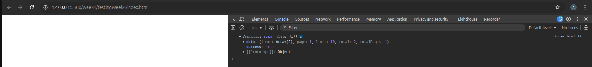
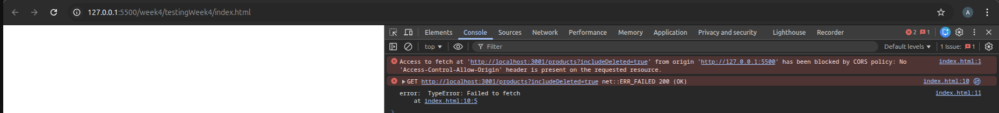
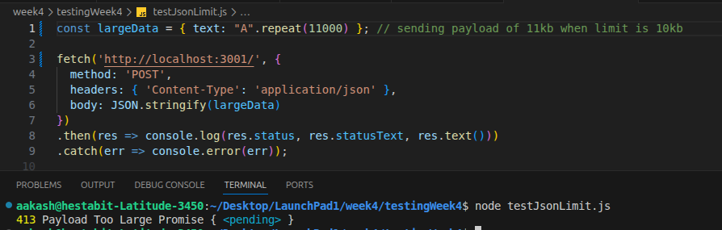
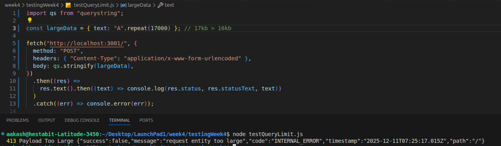
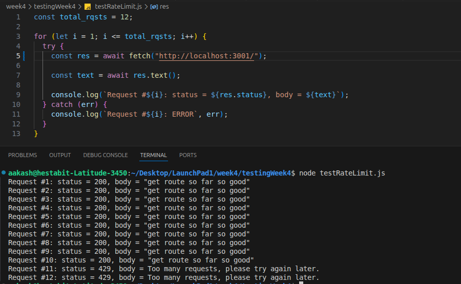
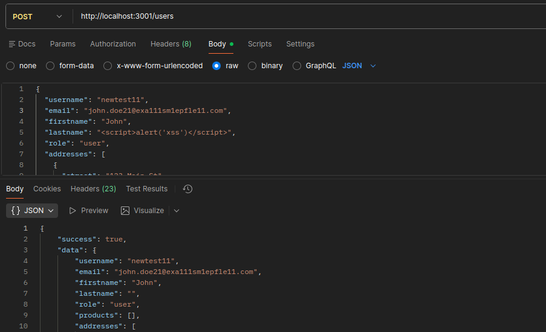
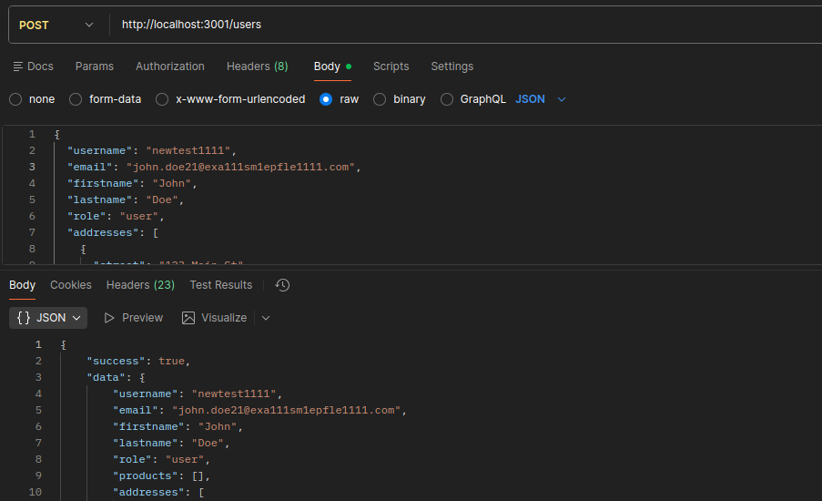
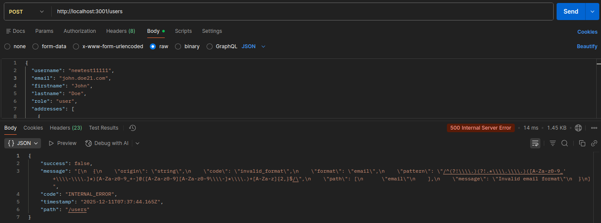

# SECURITY REPORT

1. **Whitelisted Domain - CORS Working**  
   When the domain is whitelisted, CORS works as expected.  
     

2. **CORS Error - Non-Whitelisted Domain**  
   When the domain is not whitelisted, a CORS error occurs.  
     

3. **Payload Too Large - JSON Exceeds Limit**  
   If the JSON payload exceeds the allowed limit, we receive a 'Payload Too Large' response.  
     

4. **Data Too Large - Query Exceeds Limit**  
   If the data in the query exceeds the allowed limit, we get a 'Data Too Large' response.  
     

5. **Rate Limiting - Too Many Requests**  
   As we have set the current limit to 10, after 10 requests, the server responds with 'Too Many Requests' for subsequent requests.  
     

6. **Input Field - Script Sanitization(Preventing XSS)**  
   We intentionally passed a script inside the "lastname" field, and it was sanitized.  
     

7. **Input Field - Normal Text**  
   Normal text input is not sanitized and is passed as-is.  
     

8. **Zod Validation - Invalid Email Example**  
   Zod validation detects invalid email format and returns an error for invalid fields.  
     
