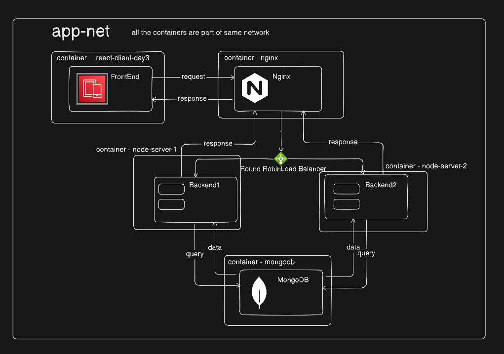

# NGINX Reverse Proxy

the architecture consists of two backend service containers, each running a Node.js api, and one NGINX container that acts as both the reverse proxy and load balancer. When a request is made to the backend, it first hits the NGINX server. From there, Nginx forwards the request to one of the backend instances. Once the backend processes the request, the response is sent back through NGINX to the client. NGINX's primary role in this setup is load balancing, using a round-robin approach by default, and acting as a reverse proxy to route the requests to the backend servers.

below is the diagram that demonstrates the flow of the service

