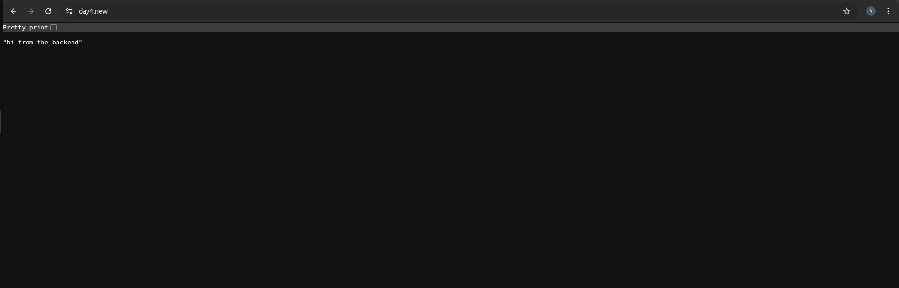
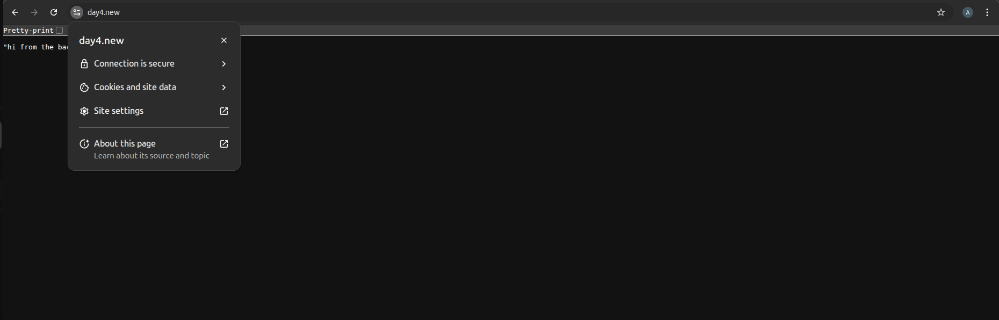
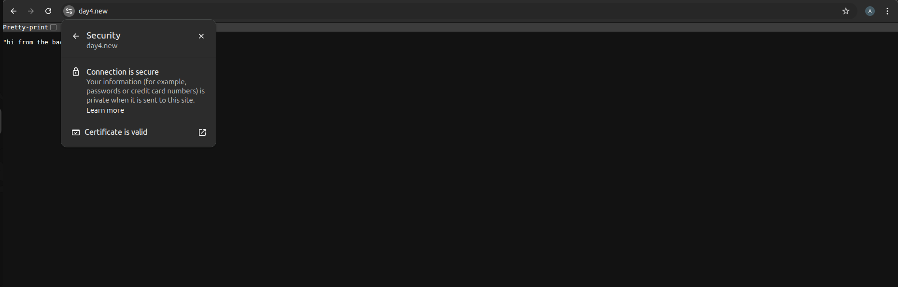

# SSL Setup Guide

## 1. Install mkcert and libnss3-tools

```bash
sudo apt install mkcert libnss3-tools
```

## 2. Set up mkcert local Certificate Authority (CA)

```bash
mkcert -install
```

This command will create a local CA and store the certificate in system's browser trust stores.

## 3. Configure NGINX

In NGINX configuration file (nginx.conf), specify the certificate file paths for SSL:

```nginx
ssl_certificate /path/to/domain-name.pem;
ssl_certificate_key /path/to/domain-name-key.pem;
```

## 4. Map the Domain to 127.0.0.1

Edit your `/etc/hosts` file and add the following entry to map the domain name to 127.0.0.1:

```
127.0.0.1    domain-name.local
```

## 5. Build Docker Compose

Run the Docker Compose command to start your containers:

```bash
docker-compose up --build
```

## 6. Test in Browser

Now, visit `https://domain-name.local` in your browser. The browser will check the certificate:
 The DNS mapping allows the browser to trust the domain.
 The certificate for the domain marks the connection as secure (HTTPS).

---
### Browser Side Flow
When we visit https://domain-name.local in browser:

The browser checks the domain mapping from /etc/hosts, confirming that domain-name.local points to 127.0.0.1.

The browser then checks the certificate used for the domain. Since the certificate is issued by the local CA, and the CA is trusted by the browser (thanks to mkcert), the connection is considered secure.

If the domain and certificate match, the browser establishes a secure HTTPS connection.

---
## Screenshot to confirm the Secure Connection
Below is the landing page screenshot
 
This screenshot shows the lock icon in the browser
 
This screenshot shows the browser shows the connection is secure
 