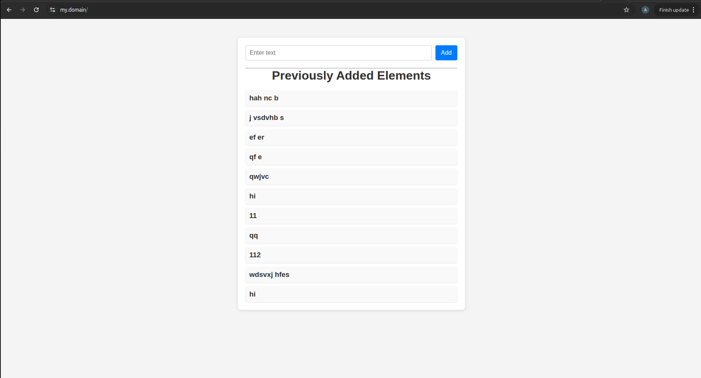
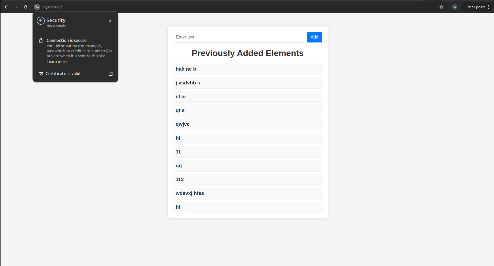
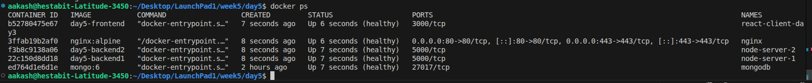

# Full-Stack Docker Deployment with Nginx and HTTPS

This project demonstrates a **production-style deployment** of a full-stack application using **Docker Compose**.

It includes a **React frontend**, **Node.js backend with load balancing**, **MongoDB for persistence**, and **Nginx as a reverse proxy with HTTPS**.

The setup follows **CI-style and production best practices** such as health checks, restart policies, environment-based configuration, and SSL termination using a custom domain.

---

## Architecture Overview

### Frontend
- React application running in a Docker container
- Served through Nginx

### Backend
- Two Node.js backend instances
- Load balanced using an Nginx upstream
- Connected to MongoDB

### Database
- MongoDB with a persistent Docker volume

### Reverse Proxy
- Nginx handles routing and HTTPS
- SSL certificates mounted into the container

---

## Services

| Service    | Description |
|------------|-------------|
| frontend   | React client |
| backend1  | Node.js API instance |
| backend2  | Node.js API instance |
| nginx     | Reverse proxy and SSL termination |
| mongo     | MongoDB database |

All services run on a shared **Docker bridge network**.

---


### Deployment Command
```
docker compose -f docker-compose.prod.yml up --build
```
The React Client is running successfully on the custom domain 


---

The SSL certificate is **Valid** as shown in the ScreenShot below 


---

All the Containers are **Healthy**


<p align="center">
  <video src="https://github.com/aakash-hestabit/LaunchPad/raw/main/week5/day5/recording_week5_day5.webm" width="100%" controls></video>
</p>