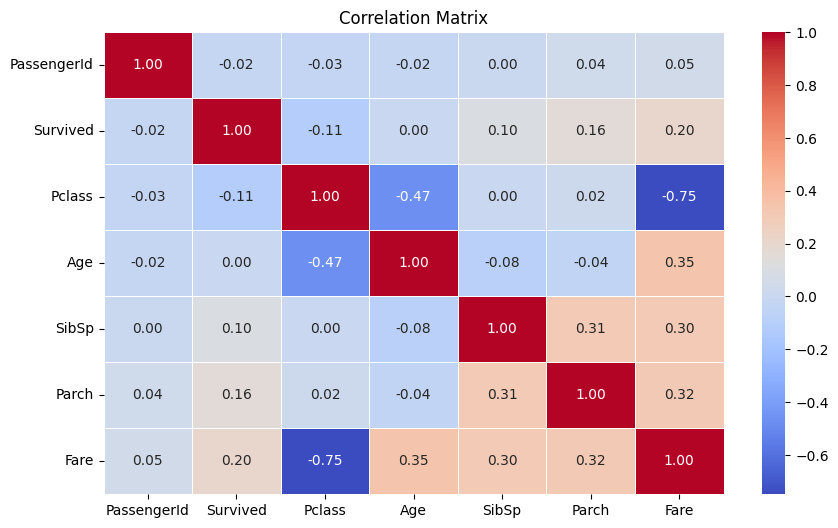
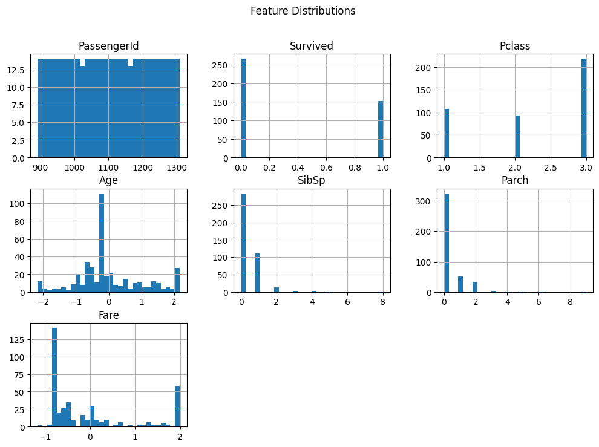
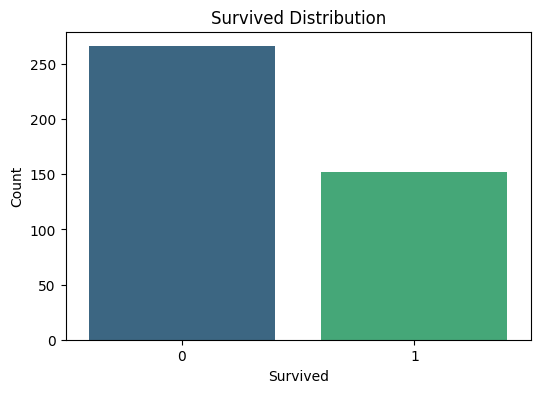
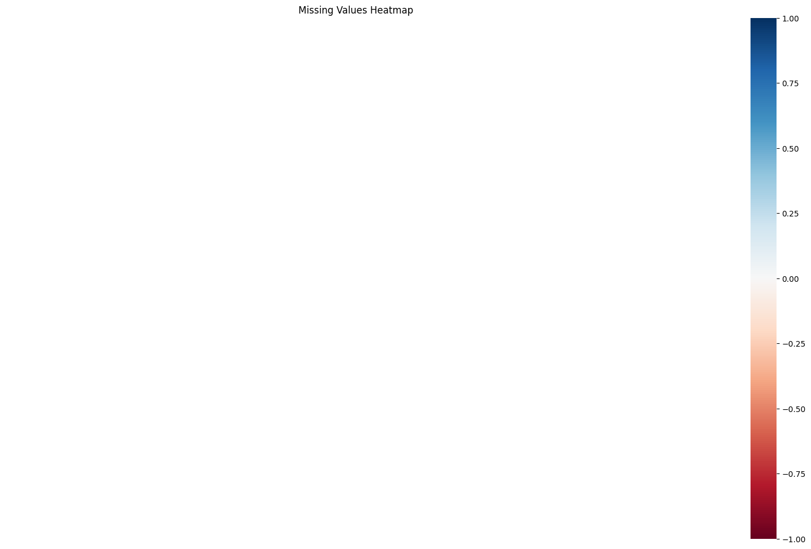

# Data Report

## 1. Correlation Matrix

The correlation matrix shows the relationships between numerical features:

- **Age** and **Fare** have a weak positive correlation.
- **Pclass** is negatively correlated with **Fare**.

---

## 2. Feature Distributions

Histograms of numerical features reveal:

- **Age**: Skewed towards younger passengers.
- **Fare**: Right-skewed with a few high-value outliers.
This Graph has been ploted with the scaled data

---

## 3. Target Distribution

The **Survived** column is almost balanced, with a slight majority of non-survivors.

---

## 4. Missing Values

The **Cabin** column has many missing values and was dropped. Other missing values (e.g., **Age**, **Fare**) were imputed.

