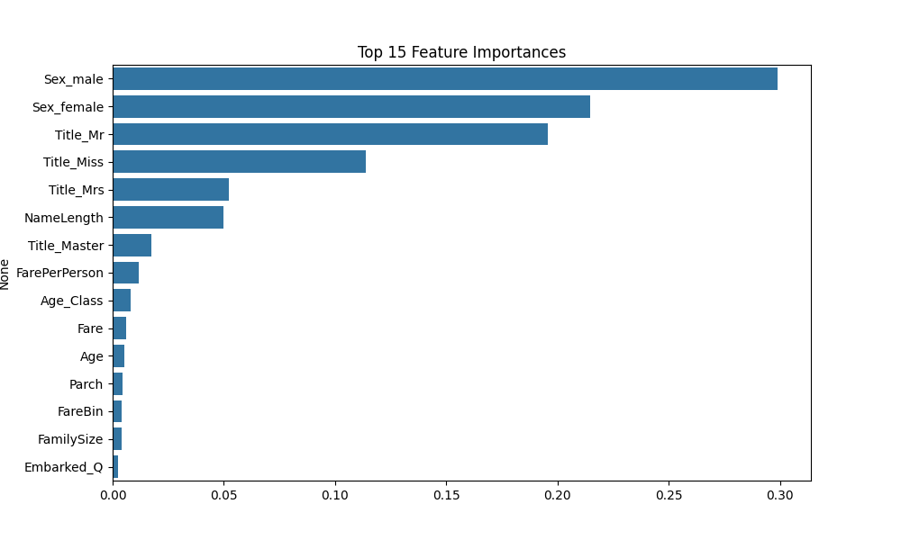

# Feature Engineering

##  New Features Generated
                                                                         
 **FamilySize**   - Combined `SibSp`(siblings/spouses) and `Parch`(Parent Children) + 1 (total family size including the passenger).
 **IsAlone**      - Boolean flag indicating if `FamilySize` is 1 (indicating the passenger is alone). 
 **Title**        - Extracted from the `Name` string (e.g., Mr, Mrs, Miss, etc.).              
 **Age_Class**    - Interaction term between `Age` and `Pclass` (Passenger Class).              
 **FarePerPerson** - Normalized fare, calculated as `Fare` divided by `FamilySize` (fare per individual in the family). 

## Transformations
- **Categorical Features:**
   One-Hot Encoding applied to `Sex`, `Embarked`, and `Title`.
- **Numerical Features:**
   `StandardScaler` applied to all continuous features to scale them (mean=0, std=1).
- **Feature Selection:**
   Random Forest Gini Importance used to rank the features based on their contribution to the model.

##  Results
The pipeline outputs:
- `X_train`, `y_train`: The training set features and labels.
- Test sets for model evaluation.

The top predictors found by the model were:
- **Sex_male**
- **Sex_female**
- **Title_Mr**
- **Title_Miss**
- **Title_Mrs**

here is the image attached 
