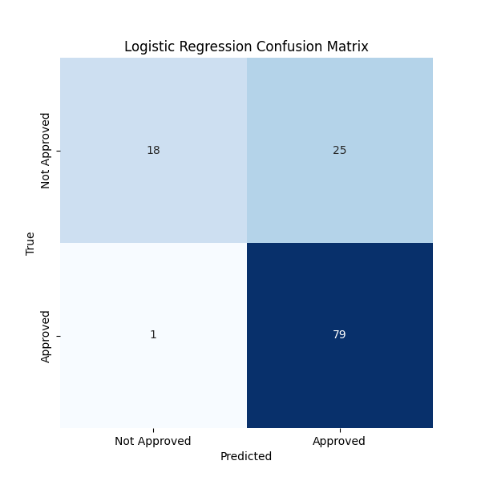
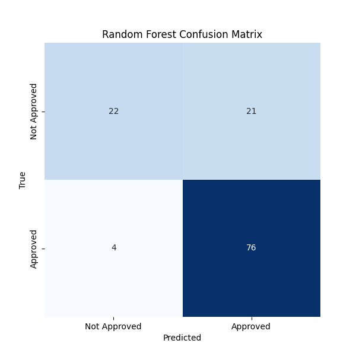

# Model Comparison

This document compares the performance of four machine learning models for loan prediction: **Logistic Regression**, **Random Forest**, **XGBoost**, and **Neural Network**.

## Model Evaluation Summary

| Model               | CV ROC AUC | Test ROC AUC | Test F1 Score |
|---------------------|------------|--------------|---------------|
| Logistic Regression  | 0.7537 (+/- 0.0143) | 0.7424       | 0.8587        |
| Random Forest        | 0.7877 (+/- 0.0411) | 0.7285       | 0.8588        |
| XGBoost              | 0.7711 (+/- 0.0469) | 0.7029       | 0.8409        |
| Neural Network       | 0.7175 (+/- 0.0295) | 0.7445       | 0.8603        |

## Confusion Matrices

- **Logistic Regression**:
  

- **Random Forest**:
  

- **XGBoost**:
  

- **Neural Network**:
  

## Conclusion

- **Best CV ROC AUC**: Random Forest (0.7877)
- **Best Test F1 Score**: Neural Network (0.8603)
- **Best Overall Model**: Random Forest (based on cross-validation)

**Reason**: Random Forest is selected as the best model based on its higher cross-validation performance (ROC AUC) and consistently strong test set results. Even though the Neural Network has the best Test F1 Score, the Random Forest provides a better generalization ability across different data splits.

This makes Random Forest the most balanced choice for deployment when considering both cross-validation and test set performance.
