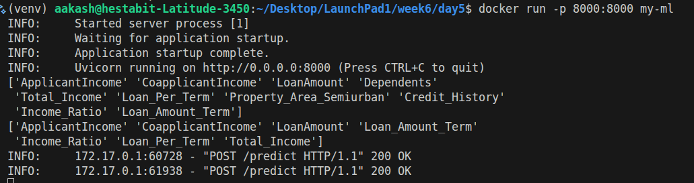
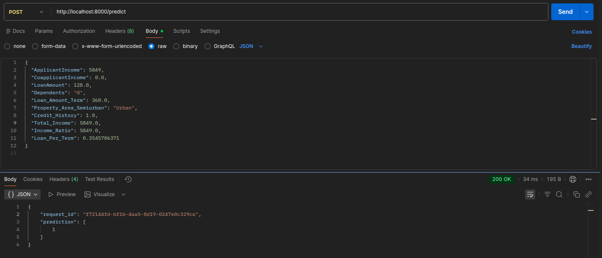
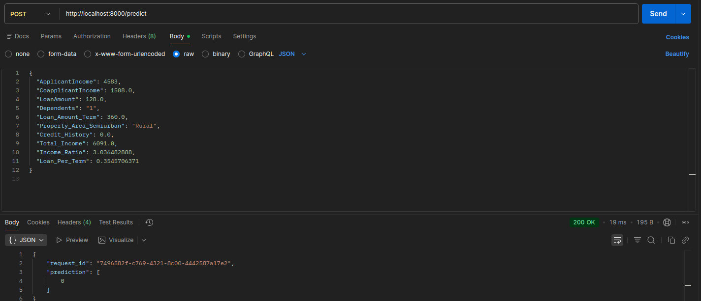

# DEPLOYMENT NOTES
## API 
The model is deployed as a FastAPI web service within a Docker container. It provides endpoint for loan approval predictions.

## Endpoint Specification
- **URL**: `http://localhost:8000/predict`
- **Method**: `POST`
- **Payload**: JSON object containing applicant features 
EG.
 ```{
  "ApplicantIncome": 4583,
  "CoapplicantIncome": 1508.0,
  "LoanAmount": 128.0,
  "Dependents": "1",
  "Loan_Amount_Term": 360.0,
  "Property_Area_Semiurban": "Rural",
  "Credit_History": 0.0,
  "Total_Income": 6091.0,
  "Income_Ratio": 3.036482888,
  "Loan_Per_Term": 0.3545706371
}
```
- **Response**: JSON object containing a unique `request_id` and the model `prediction` (0 or 1)
Eg. ;
```
{
    "request_id": "7496582f-c769-4321-8c00-4442587a17e2",
    "prediction": [
        0
    ]
}
```


## Deployment Command
```bash
docker build -f src/deployment/Dockerfile -t my-ml .
docker run -p 8000:8000 my-ml
```
this image shows docker container running successfully, confirming the API is live.

this image shows successful prediction test returning a positive (approved) result.

this image shows successful prediction test returning a negative (rejected) result.
