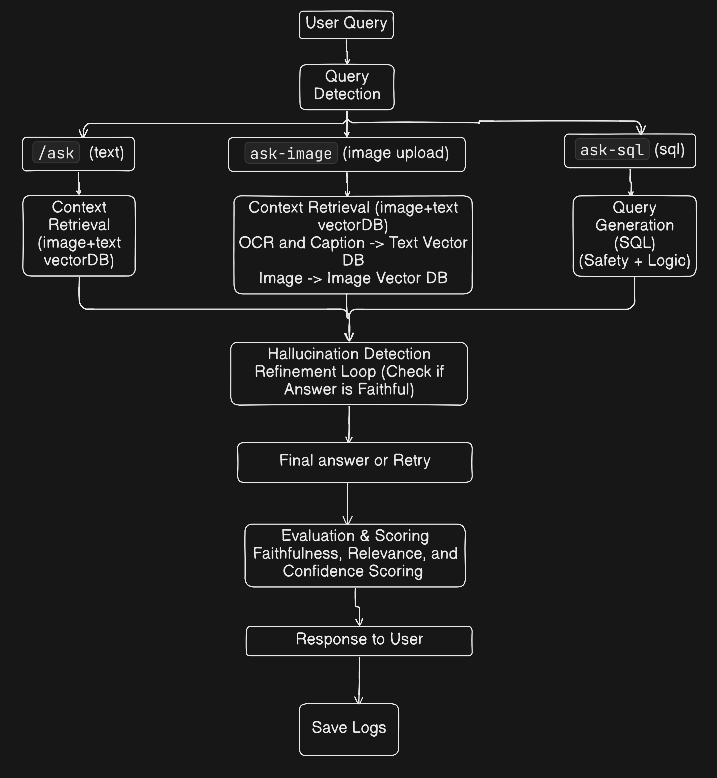

##### This system -
-  Answers text-based questions using hybrid retrieval.

-  Answers image-based questions using image search and OCR.

-  Converts natural language questions into safe, read-only SQL queries.

-  Maintains short-term conversational memory across requests.

-  Detects hallucinations and refines responses automatically.

- Logs all interactions, context, and evaluations for debugging.

##### Memory -

- Stores the last 5 user–assistant messages per session.

- Uses Redis for fast access and expiration.

- Exports chat history to local JSON files.

##### Self-Reflection and Refinement -

- Verifies generated answers against retrieved context.

- Retries generation when hallucinations are detected.

- Stops early when answers are faithful.

##### Evaluation -

- Scores faithfulness and relevance.

- Detects hallucinations based on context mismatch.

- Runs automatically after every response.

##### Logging and Debugging -

- Logs queries, context, responses, and evaluation results.

- Stores logs in CHAT-LOGS.json and history files.

- Supports auditing and offline analysis.

##### API Endpoints -

`/ask`
- Handles text-based RAG with retrieval, memory, and evaluation.

`/ask-image`
- Handles image + OCR based queries with hybrid retrieval. (uses both text and image contexts)

`/ask-sql`
- Converts natural language to SQL, validates queries, executes safely, and summarizes results.

FLOW :
