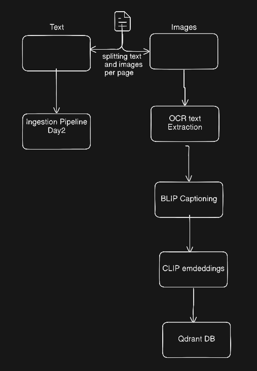
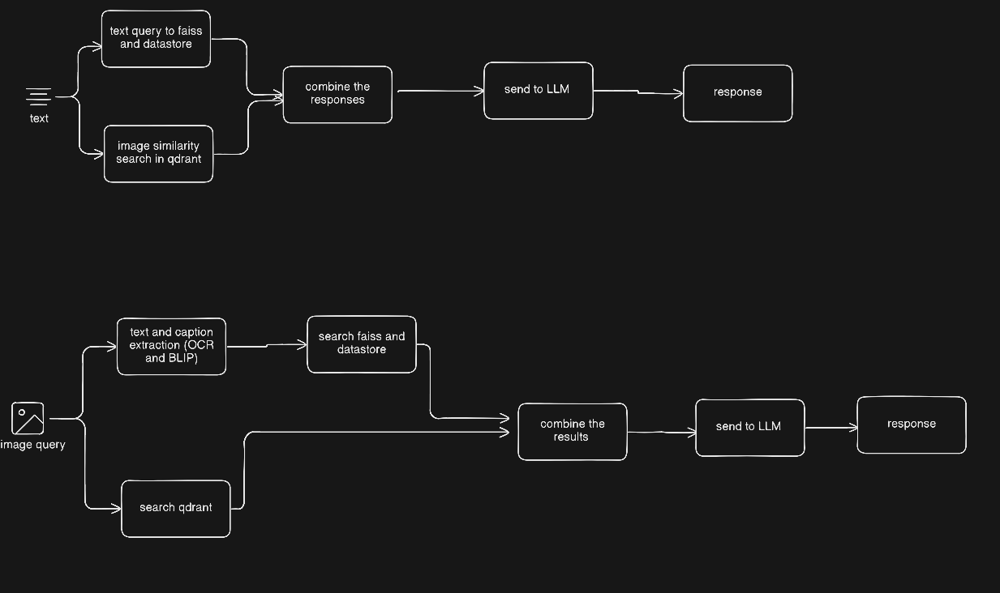

# MAGE-RAG (Multimodal RAG)

## Overview
This system implements a production-grade Image RAG pipeline supporting:
- Image ingestion (PNG, JPG, PDFs)
- OCR extraction
- Caption generation using BLIP
- CLIP-based multimodal embeddings
- Qdrant vector search

## Architecture
### Ingestion:
If we got Imges we ingest it as it is, but if we got PDF we follow a hybrid Approach in which we extract Text and Images from the pages and ingest these 
separately, for text we use the ingestoin pipeline that was used in DAY2 and for Images we use the image ingestion in DAY3 
Text -> Ingestion Pipeline used in Day 2 
Image -> OCR (Tesseract) -> Caption (BLIP) -> CLIP Embedding -> Qdrant
combine both the results and return to be passed to the LLM 

### Retrieval:
if we have an image query we simply retrive the related text and related query from respective vectorestores 
but, if we get an image as a query, we use captionaning and OCR to retrieve the text on the image and use that text as twxt query for text retrieveal and image for image retrieval

### Query Modes:
- Text -> relevant text and relevant IMages are retrieved 
- Image -> we extract the text in the image and captionize it , and the use the OCR text and Caption as twxt query and image uploaded as image query 

