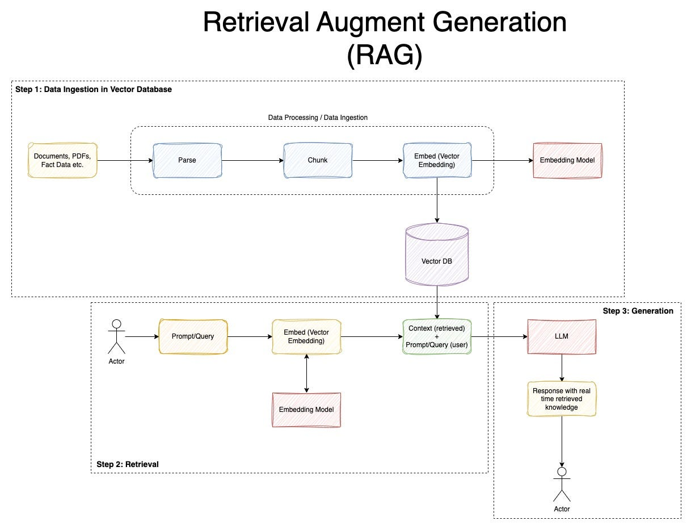

# RAG Architecture

The architecture has two main components:

Retriever: This component searches through a vector database and datastore to retrieve document chunks that are semantically similar to the query.

Generator: Once the relevant document chunks are retrieved, the generator uses them to formulate a detailed and contextually accurate response.

## Pipeline

### Ingestion and Chunking

The pipeline begins by loading different types of documents (PDF, TXT, CSV, DOCX) and converting them into manageable chunks of text. Each chunk is split
 to ensure it fits within the model's token limits (800 tokens), with some overlap (300 tokens) between adjacent chunks. The overlap is crucial because it 
 ensures that the chunks contain enough context for meaningful retrieval. Additionally, metadata (like the source document and page number) is added to each 
 chunk to keep track of where each piece of information originates from. This metadata is helpful when answering specific queries, as it allows the retriever to 
 identify the relevant sections and their locations.

### Embedding Generation

After chunking the documents, each chunk is converted to vector representation using an embedding model, such as SentenceTransformer. These embeddings capture 
the semantic meaning of the text in a fixed-length vector. Normalization of embeddings is essential because it ensures all vectors lie on a similar scale. 
Without normalization, vectors of varying magnitudes could mess up the distance calculations during retrieval, making the model less effective at identifying 
relevant chunks.

### Storing Embeddings in FAISS

The embeddings generated are stored in a FAISS index. FAISS is a highly efficient library for vector search, which allows for quick 
similarity searches in high dimensional spaces. The vectors are indexed, making it easier to find the closest matches to a query vector. Along with the 
embeddings, a separate datastore is used to store the actual document chunks and their metadata. The datastore acts as a lookup table, allowing the retriever to 
access not only the text but also metadata like the source document and page number. This separation ensures that the retrieval process remains fast and 
scalable while maintaining access to the necessary contextual information for each chunk.

### Retriever

The retriever is responsible for taking a user query and finding the most relevant document chunks by comparing their embeddings. When a query is received, it 
is first converted into an embedding using the same model that generated the document embeddings. The retriever then searches the FAISS index to find the top k (by defalut 5 in my pipeline)
most similar document chunks. The result is a list of chunks that are most relevant to the query, with their corresponding metadata (source, page number). This 
metadata is key because it helps track the origin of each chunk and allows the system to guide the user to the exact location of the information in the original 
documents.

### Generation

Once the relevant document chunks are retrieved, they are fed into the generator, which uses a language model to generate a response. The generator takes the 
query and the context from the retrieved chunks, using the combination to generate an accurate and contextually appropriate answer. The generator can pull from 
different pieces of information within the retrieved chunks, ensuring that the response is comprehensive and informed by the most relevant parts of the document. 

the complete flow is :
