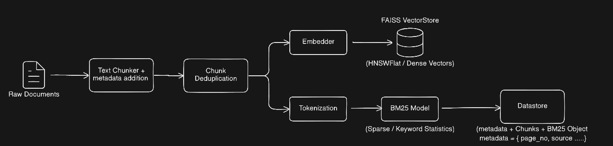
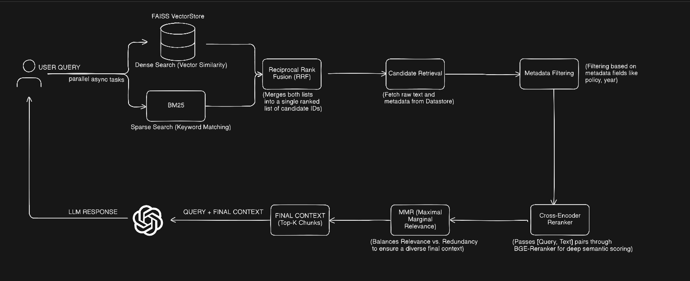

## Ingestion Pipeline

### Raw Document Processing
raw documents are first processed through the text chunker which breaks the document into smaller text chunks.
each chunk is associated with metadata (e.g., source, page number, year).

### Embedding and Vectorization
chunks of text are passed to the Embedder which converts them into dense vectors using an embedding model (BAAI/bge-base-en-v1.5).

### Tokenization
the chunks are also tokenized for sparse search, which is handled by the BM25 model. This model uses the tokenized chunks to generate keyword-based scores for the chunks.

### Indexing
- The dense vectors are stored in a FAISS Index to support fast similarity searches using vector representations.
- The BM25 model and associated metadata are stored in a datastore for efficient sparse keyword-based searches.

## Retrieval Pipeline

### User Query Processing
A user provides a query, which is used to retrieve relevant chunks of text from the datastore.

### Hybrid Search (Dense + Sparse)
The query is passed through two parallel search mechanisms:
- **Dense Search:** the query is embedded into a vector and compared against the FAISS Index to retrieve candidate chunks based on vector similarity.
- **Sparse Search:** the query is tokenized, and the BM25 model is used to retrieve chunks based on keyword matching.

### Reciprocal Rank Fusion (RRF)
the results from the dense and sparse searches are combined using the RRF technique to create a final list of ranked candidates. This balances the results from both search strategies.

### Metadata Filtering
The results can be filtered based on specific metadata fields (e.g., year, policy type) to refine the retrieved candidates.

### Reranking
the top-ranked candidates are passed through a Cross-Encoder reranker (e.g., BGE Reranker) to score them based on semantic relevance, refining the ranking further.

### MMR (Maximal Marginal Relevance)
the final step ensures diversity in the selection by applying MMR. This technique balances relevance with redundancy, ensuring that the selected results are both relevant and diverse.

