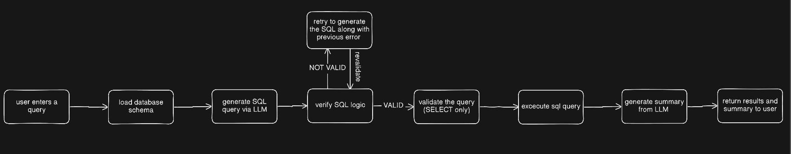

## SQL QA DOC
we start by programmatically extracting the database schema(also etracted the relations to implement joins), which is then passed to the llm alongside the user's question. once the model generates a query, i implemented a logic verification step to double-check that the code actually aligns with what the user meant. finally, i ensure the query is validated for safety before it runs in a strictly read-only environment, after which i turn the raw rows into a natural language summary.

i didn't want the model to have the power to modify data. i used keyword blacklisting for destructive commands like drop or delete and integrated sqlglot for strict syntax validation. to make the system more resilient, i tried to implement a self-healing mechanism: if a query fails execution or gets flagged by the logic check, i feed that specific error back to the model so it can try to fix its own mistake in a second pass.

