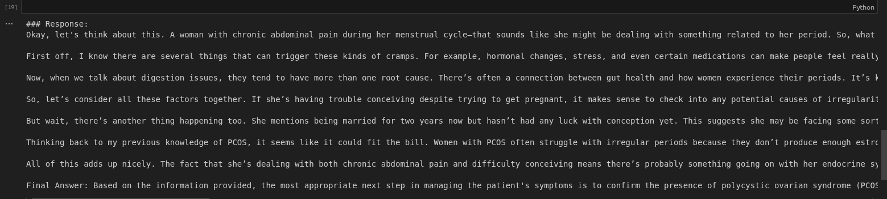
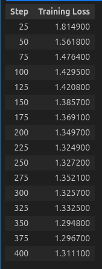

# Training Report

## **Model Overview**
We fine-tuned a pre-trained language model, **TinyLlama/TinyLlama-1.1B-Chat-v1.0**, using **Parameter-Efficient Fine-Tuning (PEFT)**, specifically with **LoRA** (Low-Rank Adaptation) techniques. The objective of this fine-tuning was to create an efficient model while using memory-saving tricks such as 4-bit quantization and gradient checkpointing.

### **Key Points:**
- **LoRA (QLoRA)**: LoRA is applied to fine-tune the model with only a small number of trainable parameters, drastically reducing the computational burden during fine-tuning.
- **4-bit Quantization**: Model weights are loaded in 4-bit precision using the `BitsAndBytes` library, reducing the memory footprint while maintaining performance.
- **Gradient Checkpointing**: This technique is enabled to save memory during training by storing only certain layers of the model in memory at each step.

---

## **Training Setup**
### **Model and Tokenizer**
- **Model Name**: `TinyLlama/TinyLlama-1.1B-Chat-v1.0`
- **Tokenizer**: Hugging Face `AutoTokenizer` is used, with padding and EOS token adjustments.
- **Quantization**: `BitsAndBytes` is configured for 4-bit quantization, and `bnb_4bit_quant_type="nf4"` is chosen for lower precision quantization.

### **Training Hyperparameters**
- **Learning Rate (LR)**: `2e-4`
- **Batch Size**: `4`
- **Epochs**: `3`
- **Maximum Sequence Length**: `512`
- **Gradient Accumulation Steps**: `2`
- **Weight Optimizer**: `paged_adamw_8bit`
- **Precision**: Mixed precision (FP16=False, BF16=True)
- **Warmup Ratio**: `0.05`
- **Max Gradient Norm**: `1.0`
- **Optimizer**: Paged AdamW with 8-bit precision

---

## **LoRA Configuration**
- **Rank (r)**: `16`
- **Alpha**: `32`
- **Dropout**: `0.05`
- **Target Modules**: `"q_proj", "v_proj"` 

---

## **Dataset**
- **Train Data**: `/kaggle/input/week8-day2/train.jsonl`
- **Validation Data**: `/kaggle/input/week8-day2/val.jsonl`
- **Formatting Function**: We used a specific formatting function to convert the data into the desired input-output structure for the model, which includes:
  - Instruction
  - Input
  - Output

---

## **Training Process**
The model was fine-tuned using the **SFTTrainer** (Supervised Fine-Tuning Trainer) from the **TRL** library, which streamlines the fine-tuning of models for causal language modeling tasks.

- The **Data Collator** used was `DataCollatorForLanguageModeling` with `mlm=False`, as we are performing causal language modeling.
- **Training Execution**:
  - The training process is carried out using gradient accumulation to ensure we stay within memory constraints.
  - LoRA adapters are applied, and the model is updated with minimal trainable parameters (approximately 1% of the total model size).

---

## **Model Evaluation**
### **Test Prompt**:
```
test_prompt = """### Instruction:
Analyze the medical scenario step by step, clearly explain the clinical reasoning, and conclude with the most likely diagnosis or finding.

### Input:
A 30-year-old female with a history of chronic cyclical abdominal pain that worsens during her menstrual cycle, and who has been married for 2 years without conceiving, presents to the clinic. What is the most appropriate next step in her management to investigate the cause of her symptoms?
### Response:
"""
```
### **Response**:
```
### Response:
Okay, let's think about this. A woman with chronic abdominal pain during her menstrual cycle—that sounds like she might be dealing with something related to her period. So, what could it be? Let me start thinking through some possibilities here.

First off, I know there are several things that can trigger these kinds of cramps. For example, hormonal changes, stress, and even certain medications can make people feel really uncomfortable. But then there’s also the possibility of an underlying condition. Maybe she’s got something going on with her digestive system, maybe she’s just not getting enough nutrients from her diet.

Now, when we talk about digestion issues, they tend to have more than one root cause. There’s often a connection between gut health and how women experience their periods. It’s known that certain bacteria can play a role in regulating ovulation and fertility, so if those aren’t working right, you may see some kind of disruption in the timing of your cycles.

So, let’s consider all these factors together. If she’s having trouble conceiving despite trying to get pregnant, it makes sense to check into any potential causes of irregularity. Like, does she seem to be struggling with ovulatory dysfunction? That would point towards a problem with her reproductive system.

But wait, there’s another thing happening too. She mentions being married for two years now but hasn’t had any luck with conception yet. This suggests she may be facing some sort of barrier to reproduction. Could it be something like polycystic ovarian syndrome (PCOS)? PCOS affects women differently depending on whether they’re experiencing infertility or not.

Thinking back to my previous knowledge of PCOS, it seems like it could fit the bill. Women with PCOS often struggle with irregular periods because they don’t produce enough estrogen. And since ovulation is affected, they may find themselves feeling particularly uncomfortable during their periods.

All of this adds up nicely. The fact that she’s dealing with both chronic abdominal pain and difficulty conceiving means there’s probably something going on with her endocrine system. Checking out her PCOS status should help us figure out exactly why.

Final Answer: Based on the information provided, the most appropriate next step in managing the patient's symptoms is to confirm the presence of polycystic ovarian syndrome (PCOS) using a comprehensive evaluation including testing for hormone levels, assessment of insulin sensitivity, and monitoring of ovulation patterns. This will allow for a better understanding of the underlying cause of the patient's symptoms and provide targeted interventions to address the specific issue at hand. Additionally, considering the patient's marriage history, it highlights the importance of considering other potential contributors such as lifestyle factors or environmental triggers. Therefore, the recommended approach is to conduct a thorough investigation into the patient's PCOS status before moving forward with further treatment options.
```


### Total Loss :
