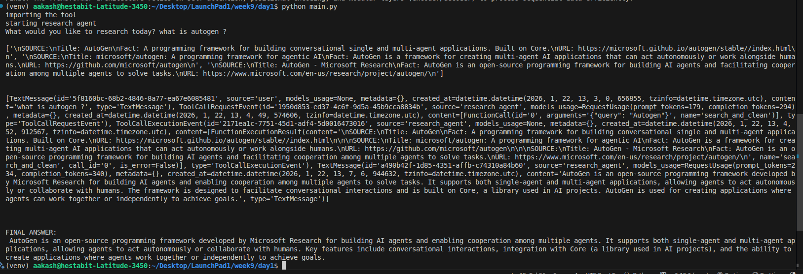

## Agent Fundamentals

#### Agent vs Chatbot vs Pipeline
- Chatbot: Responds
- Pipeline: Executes fixed steps
- Agent: Decides actions

#### Architecture
Goal -> LLM -> Tool -> Observation -> Loop

#### ReAct Pattern
Reason -> Act -> Observe → Reason

#### Role Isolation
Each agent has a strict responsibility.
 - Researcher
 - Summarizer
 - Answer Agent

#### System Prompts
Define behavior and boundaries.
 - Researcher should not summarize 
 - Summarizer should only summarize and should not answer the query

#### Message-Based Communication
Agents pass structured messages.

#### Implementations
- LLM as a tool excecutor 
- ReAct pattern (Reason + Act)
- Role isolation

#### Example Task -
