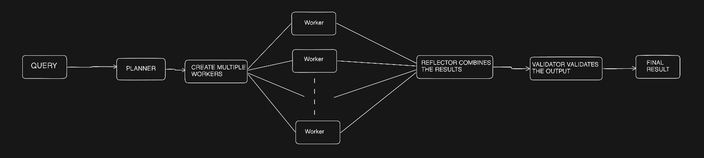
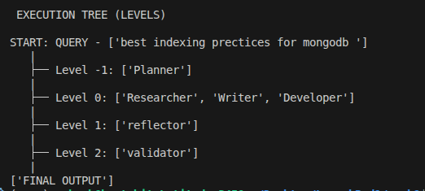

## Orchestration Overview

This system implements a **Planner-driven multi-agent orchestration pipeline**.

The **Planner Agent** analyzes the user query and decomposes it into a bounded set of independent tasks.  
Based on this plan, **Worker Agents** are instantiated dynamically and execute their tasks **in parallel**, as they have no inter-dependencies.

After all worker agents complete execution, a **Reflection Agent** runs **sequentially** to synthesize the individual outputs into a single coherent response.  
Finally, a **Validator Agent** evaluates the reflected output for correctness and completeness.  
The final answer is produced only if validation succeeds.

Parallel and sequential execution behavior is controlled entirely by the execution graph.

---

## DAG-Based Execution and Cycle Prevention

The system uses a **Directed Acyclic Graph (DAG)** for execution control, constructed programmatically using `DiGraphBuilder`.

Each agent is modeled as a node, and edges define strict execution dependencies:
- Worker Agents -> Reflection Agent -> Validator Agent

Parallelism emerges naturally from the graph structure, as worker nodes have no incoming edges.  
The DAG is validated before execution, and any cyclic dependency results in a build-time error, preventing execution.

Execution levels are derived via topological traversal of the graph, ensuring deterministic, cycle-free orchestration.

### FLOW DIAGRAM 

 below is the **Flow Diagram** for Day2:

**Excecution Tree :**
